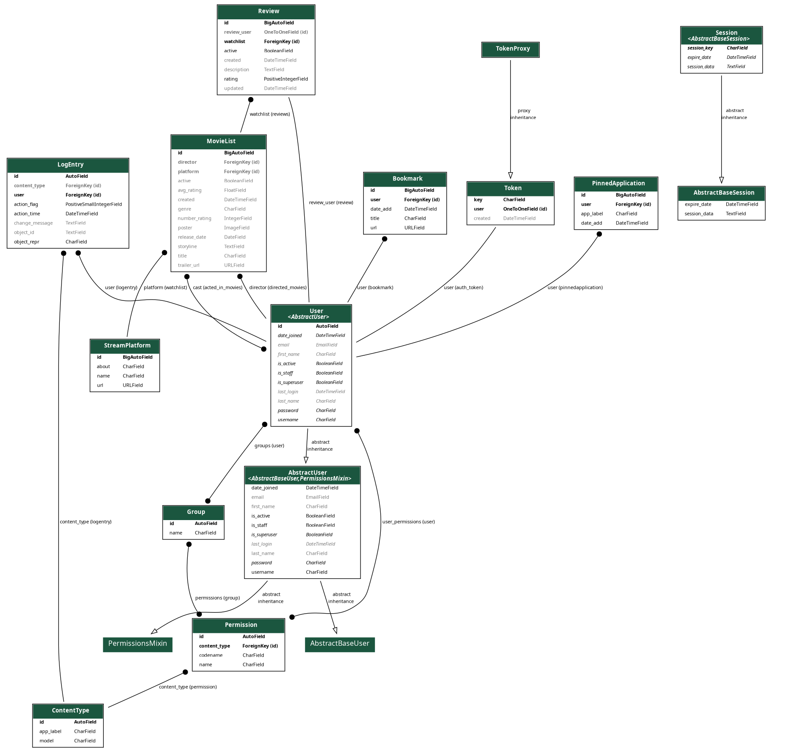

# demurtaza.blog

A brief page to illustrate about my life in particular life.

# Let's start it.

For setup, install these files

*   For **MacOS/Linux** use these line of codes

        virtualenv venv && source venv/bin/activate

*   For **Windows** use these line of codes

        virtualenv --python C:\Path\To\Python\python.exe venv
        .\venv\Scripts\activate

*   After that install dependecies from the *requirements*

        pip install -r requirements/local # for local
        pip install -r requirements/base  # for base
        pip install -r requirements/prod  # for prod

# How to Use the API
Here's how you can use the API provided by this project:

1.**Watch List**: Retrieve a list of movies.

* Endpoint: /watch/list/
* Method: GET

2.**Watch Retrieve**: Retrieve details of a specific movie.

* Endpoint: /watch/list/<lookup>/
* Method: GET

* Endpoint: /watch/list/<lookup>/
* Methods: POST, DELETE, PUT 

3.**Stream List**: Retrieve a list of streams.

* Endpoint: /watch/stream/
* Method: GET

4.**Stream Retrieve**: Retrieve a list of streams.

* Endpoint: /watch/stream/<pk>/
* Method: GET

* Endpoint: /watch/stream/<pk>/
* Methods: POST, DELETE, PUT

To interact with the application, make API requests using the provided endpoints. For example, you can use a tool like curl or a web browser to access the endpoints and retrieve data. Here's an example of how to use curl to make a GET request for the Movie List:

        curl -X GET http://127.0.0.1:8000/list/

or 

        curl -X GET https://customdomain.com/list/

## Author

- [@atabekdemurtaza](https://www.github.com/atabekdemurtaza)

## License

[MIT](LICENSE)

## Database scheme

## Logo
